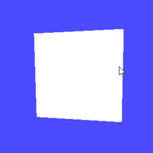

# texture0: テクスチャ第１回「画像の読み込み」サンプルプログラム

## 1. 概要

このプログラムは、OpenGL における「テクスチャマッピング (Texture Mapping)」の基礎を学ぶための、学生向けのサンプルプログラムです。本プログラムは、以下のブログ記事の解説に沿って学習を進めるための雛形として提供されています。

- [テクスチャ第１回：画像の読み込み](https://tokoik.github.io/blog/opengl/%E3%83%86%E3%82%AF%E3%82%B9%E3%83%81%E3%83%A3/2004/09/13/texture.html)

3DCG において、物体の表面に画像（テクスチャ）を貼り付けることで、少ない頂点数でリアルな質感を表現する技術をテクスチャマッピングと呼びます。本プロジェクトは、その手順を段階的に学ぶための最初の雛形プログラムです。

現段階ではウィンドウ上に照明があたった1枚の四角形ポリゴンが表示されるだけのシンプルな内容となっており、ブログ記事の手順に従って、車のタイヤの RAW 画像ファイル (tire.raw) をプログラム内に読み込む処理を実装していくことになります (この第１回の段階ではテクスチャのデータをメモリに読み込むだけであり、表示結果はまだ変化しません)。



マウスのドラッグ操作によって、表示されている四角形をぐるぐると回転させることができます。

## 2. ビルド方法

このプログラムは [CMake](https://cmake.org/) を用いてビルド環境を整備します。各OSとも、ソースコードが置かれているディレクトリにターミナル（またはコマンドプロンプト）で移動してから、以下の手順を実行してください。なお、プログラムをビルドするためのバイナリディレクトリは、バージョン管理ファイル（.gitignore）の設定に合わせて build という名前にします。

> cmake-gui で設定することも可能です。その際は、`Source code path` にはプロジェクトのフォルダを指定し、`Build path` にはプロジェクトのフォルダの中に作った build というフォルダを指定してください。その後、`Configure` → `Generate` の順にクリックした後、`Open Project` をクリックすれば、開発環境が起動するはずです。

### 2.1 Windows (Visual Studio 2022 の場合)

1. コマンドプロンプトまたは PowerShell を開き、このプロジェクトのディレクトリに移動します。

2. 以下のコマンドを実行してビルドディレクトリを作成し、CMake で構成を行います。

```bat
mkdir build
cd build
cmake .. -G "Visual Studio 17 2022"
```

3. 生成された build フォルダ内の texture0.sln を Visual Studio で開きます。

4. ソリューションエクスプローラーで texture0 プロジェクトを右クリックし、「スタートアップ プロジェクトに設定」を選択します。

5. 「ローカル Windows デバッガー」をクリックするか、F5 キーを押してビルドおよび実行します。

### 2.2 macOS (Xcode の場合)

1. ターミナルを開き、このプロジェクトのディレクトリに移動します。

2. 以下のコマンドを実行してビルドディレクトリを作成し、Xcode 用のプロジェクトを生成します。

```sh
mkdir build
cd build
cmake .. -G Xcode
```

3. 生成された build/texture0.xcodeproj を Xcode で開きます。

4. 左上のスキーム選択（再生ボタンの横）が texture0 になっていることを確認します。

5. 「Run」ボタン（再生ボタン）をクリックするか、Command + R を押してビルドおよび実行します。

### 2.3 Ubuntu Linux

1. ターミナルを開き、このプロジェクトのディレクトリに移動します。

2. 必要なパッケージ（freeglut3-dev や pkg-config など）がインストールされていることを確認し、以下のコマンドでビルドします。

```sh
mkdir build
cd build
cmake ..
make
```

## 3. 使い方

### 3.1 プログラムの起動方法

各OSとも、ビルド後に生成されるバイナリディレクトリ (build) やそのサブフォルダから起動します。（※ CMake の設定により、Windows や Xcode では Debug などのフォルダ下に実行ファイルが置かれることがあります）

- **Windows**

Visual Studio 上で「ローカル Windows デバッガー」をクリックして実行するか、またはコマンドプロンプトから以下のコマンドで起動します。

```cmd
cd build\Debug
texture0.exe
```

- **macOS**

Xcode 上で左上の「Run（再生ボタン）」をクリックするのが楽です。これにより texture0.app アプリケーションバンドルとして自動的に実行されます。アプリケーションバンドルを直接起動するなら、Finder から build/Debug/texture0.app をダブルクリックするか、ターミナルから open build/Debug/texture0.app を実行します (この場合はエラーメッセージ等が表示されません)。

- **Ubuntu Linux**

ターミナルから以下のコマンドで実行ファイル（バイナリ）を直接起動します。

```sh
cd build
./texture0
```

### 3.2 操作方法

- **マウスの左ボタンでドラッグ**: 画面内のオブジェクト（四角形）を３次元的に回転させることができます。

- **キーボードの q, Q または ESC キー**: プログラムを終了します。

## 4. 解説

このプログラムの主要なソースコードである main.cpp は、OpenGL (GLUT) を用いた最も基本的な3次元グラフィックス描画プログラムの構造を持っています。実行される大まかな処理手順と、それぞれの関数がどのようなアルゴリズム・役割で行われているかを解説します。

### 4.1 main() 関数

プログラムの入り口です。初期化処理として GLUT のウィンドウ作成を行い、その後各イベント（毎フレームの描画、ウィンドウサイズ変更、マウス操作、キーボード入力など）が発生した際に呼び出されるコールバック関数をシステムに登録します。最後に glutMainLoop() を呼び出すことで、イベント待ちの無限ループに入ります。以降は、登録された各関数が自動的に呼び出される形で処理が進みます。

### 4.2 init() 関数

プログラム起動後、描画ループに入る前に一度だけ呼ばれる初期設定です。
3D空間の背景色を設定し、隠面消去（手前の物体に隠れた奥の物体を描画しない処理 GL_DEPTH_TEST）を有効にしています。また、光源（ライト）の設定を行い、光の色・強さ（直接光や環境光）などを定義・有効化しています。

### 4.3 scene() 関数

実際に画面に表示される物体（3Dモデル）を描画する処理が書かれています。
glBegin(GL_QUADS) から glEnd() の間に、4つの頂点座標を glVertex3d() によって指定することで、1枚の四角形ポリゴンを描画します。ここでは光の反射を計算するために glNormal3d() で法線ベクトル（面が向いている方向）を指定し、glMaterialfv() でポリゴン自体の材質（色）を設定しています。今後、この関数にテクスチャ座標の設定を追加していくことになります。

### 4.4 display() 関数

画面全体の描画処理を行います（システムの描画要求ごとに呼び出されます）。
まずモデルビュー変換行列（被写体の位置や視点の向きを管理する行列）を初期化し、光源の位置を設定します。その後、視点を少し後ろに下げ、トラックボール操作による回転行列を掛け合わせることで、オブジェクトの姿勢を決定します。画面（カラーバッファとデプスバッファ）をまっさらな状態にクリアした上で scene() を呼び出し、内部で描画したものを glutSwapBuffers() で画面に表示します（ちらつきを抑えるダブルバッファリングという手法です）。

### 4.5 resize() 関数

ウィンドウのサイズが変更されたり、最初にウィンドウが開かれた際に呼ばれます。
変更されたウィンドウサイズに合わせて描画領域（ビューポート）を合わせ、カメラのレンズに相当する透視投影（パースペクティブ）の行列設定を行います。これにより、ウィンドウを引き伸ばしても図形が歪まないように調整されます。

### 4.6 mouse(), motion() 関数

マウスによるドラッグ操作を処理します。これらの関数は専用のトラックボール処理プログラムと連携し、クリックした座標と動かした座標の差分からオブジェクトを回転させるための計算を行っています。

### 4.7 keyboard() 関数

キーボードの入力を受け取ります。本プログラムでは、ESC キーや 'q' キーが押されたときに exit(0) を呼び出し、プログラムを安全に終了させる役割を担っています。

### 4.8 idle() 関数

プログラムが他に処理をしていない空き時間に呼ばれ続けます。常に画面を再描画する指示 (glutPostRedisplay()) を出しているため、マウスを操作している間にオブジェクトがスムーズにアニメーション（回転）するようになります。
